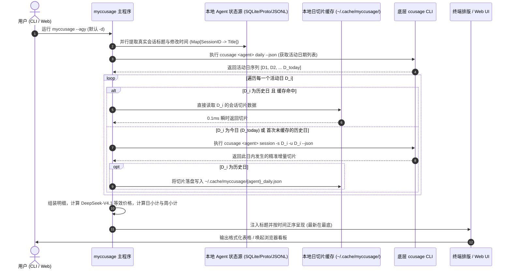

# myccusage

[](https://pypi.org/project/myccusage/)
[](https://www.python.org/)
[](LICENSE)

> **专为开发者打造的多 AI 编程 Agent 本地会话用量分析与 DeepSeek-V4.1-Flash 高峰期等效计费工具。**  
> 支持 7 大主流编程智能体：**Google Antigravity**、**Claude Code**、**Hermes Agent**、**OpenAI Codex**、**Grok**、**Pi Agent**、**OpenCode**。

---

## 🌟 核心特性

- 🔀 **方案 A：双模分流架构**
  - **每日账本模式 (`-d` / `--daily`，默认)**：严格按“此日、此 Session”切片统计，彻底解决跨日会话导致的日消耗漂移与前日用量被“窃取”问题，日小计与周小计精准可信。
  - **项目总览模式 (`-s` / `--session`)**：专注统计每个 Project / Session 的全生命周期累计总消耗，清晰核算大型工程与重构项目的整体成本。
- 🔍 **原生元数据深度提取**：告别冷冰冰的 UUID，直击底层数据源（Protobuf 二进制、SQLite 数据库、JSONL 日志）提取人类可读的真实会话标题与活跃时间。
- 💰 **严格 Token 守恒与最新官方等效折算**：
  - 默认遵循：`总 Token = Input + Cache + Output`。
  - 对齐 **DeepSeek-V4.1-Flash 最新官方定价**（输入未命中 ¥2.00/M，缓存命中 ¥0.04/M，输出 ¥8.00/M），自动换算人民币（¥）与美元（$）。
- ⚡ **毫秒级两级缓存 (`~/.cache/myccusage/`)**：已结账历史日自动落盘，仅对“今日”与活跃日进行增量切片同步，7 个 Agent 均在 1~2 秒内秒级出表。
- 🖥️ **高颜值本地 Web 仪表盘 (`--web` / `-w`)**：无需构建，秒级启动。提供全 Agent 全景对比看板、趋势堆叠图、Token 环形构成图，支持计价模型动态切换与自定义导入管理。

---

## 📦 安装指南

### 第一步：安装前置依赖开源项目 `ccusage`（必选）

`myccusage` 依赖底层开源工具 [ccusage](https://github.com/ryoppippi/ccusage) 获取各 Agent 的底层 Token 切片数据。请先在终端中通过 npm、bun 或 pnpm 完成全局安装：

```bash
# 使用 npm 全局安装
npm install -g ccusage

# 或使用 bun 全局安装
bun add -g ccusage

# 或使用 pnpm 全局安装
pnpm add -g ccusage
```

安装完成后，可运行 `ccusage --version` 确认已正确安装并处于系统 PATH 中。

---

### 第二步：安装 `myccusage`

#### 推荐方式：通过 pip 安装

```bash
pip install myccusage
```

#### 国内镜像加速安装

若在国内网络环境下，推荐使用清华大学镜像源极速下载：

```bash
pip install -i https://pypi.tuna.tsinghua.edu.cn/simple myccusage
```

#### 源码安装（针对开发者）

```bash
git clone https://github.com/RichardHuang0001/ccusage-sessions.git
cd ccusage-sessions
chmod +x install.sh && ./install.sh
```

安装后将自动注册全局命令 `myccusage` 与 `ccusage-sessions`。

---

## 🚀 快速上手与常用命令

### 1. 支持的 Agent 参数

| Agent 名称 | 命令行参数 | 底层 CLI 命令 |
| :--- | :--- | :--- |
| **Google Antigravity** | `--agy`, `--antigravity` | `ccusage antigravity` |
| **Claude Code** | `--claude` | `ccusage claude` |
| **Hermes Agent** | `--hermes` | `ccusage hermes` |
| **OpenAI Codex** | `--codex` | `ccusage codex` |
| **Grok** | `--grok` | `ccusage grok` |
| **Pi Agent** | `--pi` | `ccusage pi` |
| **OpenCode** | `--opencode` | `ccusage opencode` |

### 2. 常用操作示例

```bash
# 1. 查看 Google Antigravity 每日会话账本 (默认按时间正序，最新在最底，小计防漂移)
myccusage --agy

# 2. 查看 Claude Code 每日账本
myccusage --claude

# 3. 查看 Antigravity 项目全生命周期总览 (累计任务总消耗)
myccusage --agy -s

# 4. 找出消耗最大的“Token 吞吐大户”项目 (按 Token 用量降序)
myccusage --agy -s -t

# 5. 一键启动本地 Web 前端仪表盘并自动唤起浏览器 (默认端口 8488)
myccusage --web

# 6. 指定端口启动 Web 仪表盘
myccusage --web -p 9000
```

---

## 🏛️ 系统架构设计

`myccusage` 采用高内聚、轻量级的模块化分层架构，零大型外部框架依赖：

### 1. 架构分层 (Architecture Layers)

```
┌─────────────────────────────────────────────────────────────────────────┐
│                    User Terminal / CLI Interface                        │
│             myccusage [--agy|--claude|--hermes|...] [-d|-s] [-t]        │
└────────────────────────────────────┬────────────────────────────────────┘
                                     │
                                     ▼
┌─────────────────────────────────────────────────────────────────────────┐
│ 1. 参数路由与配置解析 (Argument Routing & Config Resolver)                 │
│    - 识别目标 Agent 类型（映射至底层 ccusage 子命令）                         │
│    - 模式仲裁：-d (默认每日账本) vs -s (项目全生命周期)                        │
│    - 排序控制：时间正序 (最新在最底) vs -t (Token 用量降序)                   │
└───────────────────┬─────────────────────────────────┬───────────────────┘
                    │                                 │
                    ▼                                 ▼
┌──────────────────────────────────────┐  ┌───────────────────────────────┐
│ 2. 原生元数据提取引擎                  │  │ 3. 数据切片与智能缓存层       │
│    (Native Title & Metadata Engine)  │  │    (Slice Engine & Cache)     │
│  - Antigravity: protobuf / jsonl     │  │  - 全局日度基准：ccusage daily │
│  - Claude Code: history & projects   │  │  - 历史切片缓存：~/.cache/...  │
│  - Hermes/OpenCode: SQLite DB        │  │  - 跨日单日精确切片：          │
│  - Codex/Grok/Pi: session indices    │  │    ccusage session -s D -u D  │
└───────────────────┬──────────────────┘  └───────────────┬───────────────┘
                    │                                     │
                    └──────────────────┬──────────────────┘
                                       │
                                       ▼
┌─────────────────────────────────────────────────────────────────────────┐
│ 4. 计费与聚合内核 (Accounting & Aggregation Core)                         │
│    - 约束校验：Total = Input + Cache + Output                           │
│    - DeepSeek-V4.1-Flash 官方高峰期定价模型 (未命中¥2/M, 命中¥0.04/M, 输出¥8/M)│
│    - 分层聚合：会话明细 -> 日计 (含星期指示) -> 周计 (ISO-W) -> 全周期汇总    │
└───────────────────┬─────────────────────────────────┬───────────────────┘
                    │                                 │
                    ▼                                 ▼
┌──────────────────────────────────────┐  ┌───────────────────────────────┐
│ 5. 终端排版与渲染器                   │  │ 6. 本地 Web 仪表盘服务        │
│    (Terminal Responsive Formatter)   │  │    (Zero-Dependency Web UI)   │
│  - East Asian Width 字符对齐         │  │  - 原生 Python HTTP Server    │
│  - 视口自适应表格与小计渲染           │  │  - 客户端动态重算与图表双轴   │
└──────────────────────────────────────┘  └───────────────────────────────┘
```

### 2. 端到端调用流程 (Sequence Call Flow)



---

## 🤖 面向 AI Agent 与二次开发者

如果您是 **AI Coding Assistant**（如 Antigravity、Claude Code、Cursor、Copilot 等）或准备对本项目进行二次开发，请阅读专属维护文档：

👉 **[README.agent.md](README.agent.md)**

该文档详细提供了：
1. **计价规则体系**：JSON 导入导出规范、浏览器 `localStorage` 存储机制、`calc_deepseek_cost` 算法实现；
2. **主要模块与接口清单**：`core.py`、`cli.py`、`server.py` 与 `app.js` 的完整核心函数与数据结构说明；
3. **扩展指南**：如何增加新 Agent 适配、如何自定义计价规则、本地调试与发版规范。

---

## 📄 开源许可证

本项目基于 [MIT License](LICENSE) 开源发布。
