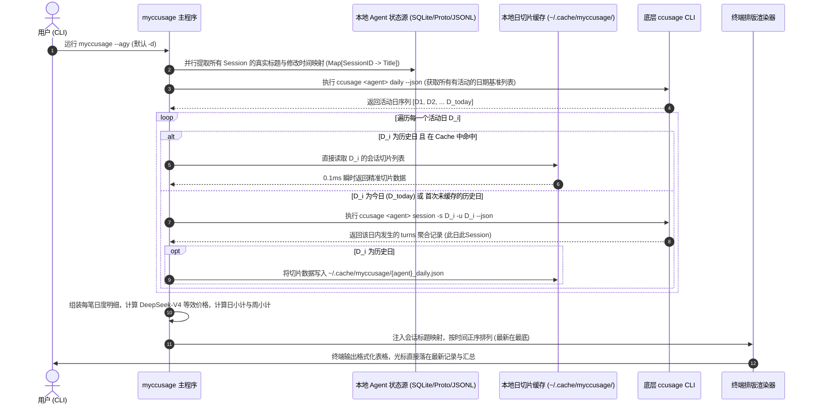
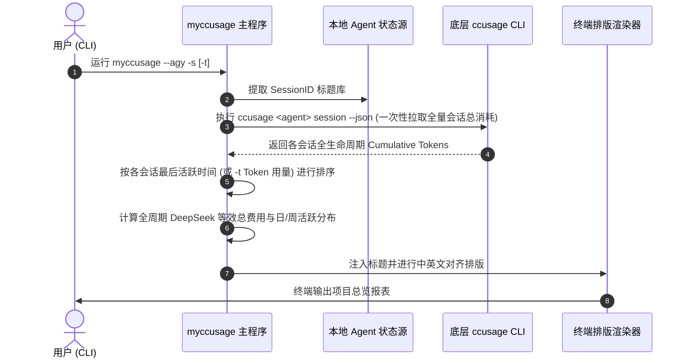

# myccusage

`myccusage` 是一个专为开发者打造的多 AI 编程 Agent（Antigravity、Claude Code、Hermes、Codex、Grok、Pi、OpenCode）本地会话用量分析与 **DeepSeek-V4-Flash 高峰期等效计费** 命令行工具。

支持极速双模分流（默认每日账本模式 vs 项目总览模式），完美解决多日跨度会话导致的日消耗漂移与前日用量被“窃取”问题。

---

## 🌟 核心特性

### 1. 方案 A：双模分流模式 (Dual-Mode CLI)
- **`-d` / `--daily` [默认模式]：每日会话账本模式**
  - **核心设计**：“此日、此 Session”。如果一个会话跨越了昨天与今天，今天只统计**今天实际发生**的 Token 增量，昨天只保留昨天实际发生的净消耗。
  - **防漂移日/周小计**：每日小计与每周小计严格对应真实发生额，绝不混淆前日用量。
  - **极速秒开智能缓存 (`~/.cache/myccusage/`)**：历史已结账日自动落盘缓存，仅对“跨日活动日”与“今日”进行精确切片同步，7 个 Agent 均在 1~2 秒内秒级出表。
- **`-s` / `--session`：项目全生命周期总览模式**
  - **核心设计**：专注于每个 Project / Session 从创建到当前的总消耗，帮助你直观评估一个大型工程任务、代码重构项目的全生命周期总成本。
  - 支持配合 `-t` / `--tokens` 找出消耗最大的“Token 吞吐大户”项目。

### 2. 输出排序优化
- 默认采用**时间正序（最新在最底部）**，打开终端查看即直接落在最新日期与最新会话上，省去每次手动向下滑动的繁琐操作。
- 每日小计、每周小计自然呈现在对应周期下方。

### 3. 严格的 Token 守恒与 DeepSeek-V4-Flash 等效计费
- 严格遵循：`总 Token = Input + Cache + Output`
  - **Input（输入未命中）**：¥3.00 / 1M Tokens
  - **Cache（KV 缓存命中）**：¥0.10 / 1M Tokens
  - **Output（输出 + 思维链/Reasoning）**：¥9.00 / 1M Tokens
- 自动转换等效人民币（¥）与等效美元（$）。

### 4. 深度原生会话标题与元数据解析
全自动从底层数据源提取真实提问或项目标题，告别冷冰冰的 Session ID：
- **Google Antigravity**：从 `agyhub_summaries_proto.pb` 二进制反序列化提炼，回退解析 `transcript.jsonl` 首行 prompt。
- **Claude Code**：解析 `history.jsonl` 与各项目日志 `.claude/projects/*/*.jsonl`。
- **Hermes Agent**：直接读取 `.hermes/state.db` SQLite 数据库会话标题与精确时间。
- **OpenAI Codex**：解析 `.codex/session_index.jsonl` 与各 session rollout 记录。
- **Grok**：读取 `.grok/sessions/session_search.sqlite` 与 `prompt_history.jsonl`。
- **Pi Agent**：读取 `.pi/agent/sessions/*/*.jsonl` 第一轮消息 prompt。
- **OpenCode**：连接 `.local/share/opencode/opencode.db` 提取会话主题。

### 5. 现代化 Web 前端 Dashboard 仪表盘 (`--web` / `-w`)
- **一键免构建秒级启动**：运行 `myccusage --web` 自动开启本地轻量服务并打开默认浏览器，零第三方 pip / npm 依赖。
- **全 Agent 全景对比**：支持在一张看板上汇总 7 大 Agent 的总支出与用量分布，直观对比各大 AI 助手的使用频度。
- **趋势与构成可视化**：内置每日堆叠趋势图（Output / Input Miss / Cache Hit）与费用走势双轴分析，以及 Token 占比环形图。
- **客户端毫秒级检索**：即时模糊搜索标题与 Session ID，支持按周、按日树状层级折叠与一键复制 Session ID。

---

## 🏛️ 系统架构设计与调用链

`myccusage` 采用极轻量、高内聚的分层架构，无任何外部重型依赖，整体由 **CLI 参数路由层**、**双轨元数据提取引擎**、**数据切片与两级缓存层**、**Token 计价内核** 以及 **自适应终端渲染器** 组成。

### 1. 系统架构分层 (Architecture Layers)

```
┌─────────────────────────────────────────────────────────────────────────┐
│                    User Terminal / CLI Interface                        │
│             myccusage [--agy|--claude|--hermes|...] [-d|-s] [-t]        │
└────────────────────────────────────┬────────────────────────────────────┘
                                     │
                                     ▼
┌─────────────────────────────────────────────────────────────────────────┐
│ 1. 参数路由与配置解析 (Argument Routing & Config Resolver)                 │
│    - 识别目标 Agent 类型（映射至底层 ccusage 子命令）                         │
│    - 模式仲裁：-d (默认每日账本) vs -s (项目全生命周期)                        │
│    - 排序控制：时间正序 (最新在最底) vs -t (Token 用量降序)                   │
└───────────────────┬─────────────────────────────────┬───────────────────┘
                    │                                 │
                    ▼                                 ▼
┌──────────────────────────────────────┐  ┌───────────────────────────────┐
│ 2. 原生元数据提取引擎                  │  │ 3. 数据切片与智能缓存层       │
│    (Native Title & Metadata Engine)  │  │    (Slice Engine & Cache)     │
│  - Antigravity: protobuf / jsonl     │  │  - 全局日度基准：ccusage daily │
│  - Claude Code: history & projects   │  │  - 历史切片缓存：~/.cache/...  │
│  - Hermes/OpenCode: SQLite DB        │  │  - 跨日单日精确切片：          │
│  - Codex/Grok/Pi: session indices    │  │    ccusage session -s D -u D  │
└───────────────────┬──────────────────┘  └───────────────┬───────────────┘
                    │                                     │
                    └──────────────────┬──────────────────┘
                                       │
                                       ▼
┌─────────────────────────────────────────────────────────────────────────┐
│ 4. 计费与聚合内核 (Accounting & Aggregation Core)                         │
│    - 约束校验：Total = Input + Cache + Output                           │
│    - DeepSeek-V4-Flash 官方高峰期定价模型 (未命中¥3/M, 命中¥0.1/M, 输出¥9/M)│
│    - 分层聚合：会话明细 -> 日计 (含星期指示) -> 周计 (ISO-W) -> 全周期汇总    │
└──────────────────────────────────────┬──────────────────────────────────┘
                                       │
                                       ▼
┌─────────────────────────────────────────────────────────────────────────┐
│ 5. 终端动态排版与渲染器 (Terminal Responsive Formatter)                  │
│    - East Asian Width 宽度计算（确保中英文字符在终端严格对齐）            │
│    - 终端宽度动态感知与智能截断 (shutil.get_terminal_size)                 │
│    - 视口友好渲染（最新会话直接沉底显示）                               │
└─────────────────────────────────────────────────────────────────────────┘
```

### 2. 核心端到端调用链 (Execution Call Flow)

#### 模式一：`-d` / `--daily` [默认] 每日账本模式调用链



#### 模式二：`-s` / `--session` 项目全生命周期总览模式调用链



---

## 🚀 支持的 Agent 参数

| Agent | 参数 | 对应官方 CLI | 数据源解析机制 |
| :--- | :--- | :--- | :--- |
| **Google Antigravity** | `--agy`, `--antigravity` | Antigravity App / CLI | `agyhub_summaries_proto.pb` + `transcript.jsonl` |
| **Claude Code** | `--claude` | `claude` | `history.jsonl` + `.claude/projects/*/*.jsonl` |
| **Hermes Agent** | `--hermes` | `hermes` | `.hermes/state.db` (SQLite) |
| **OpenAI Codex** | `--codex` | `codex` | `.codex/session_index.jsonl` + session logs |
| **Grok** | `--grok` | `grok` | `.grok/sessions/session_search.sqlite` + `prompt_history.jsonl` |
| **Pi Agent** | `--pi` | `pi` | `.pi/agent/sessions/*/*.jsonl` |
| **OpenCode** | `--opencode` | `opencode` | `.local/share/opencode/opencode.db` (SQLite) |

---

## 🛠️ 前置条件 (Prerequisites)

本项目基于开源的 [ccusage](https://github.com/ryoppippi/ccusage) 获取底层基础切片，请确保已安装 `ccusage`（二选一即可）：

```bash
# 使用 npm 安装
npm install -g ccusage

# 或使用 bun 安装
bun add -g ccusage
```

---

## 💻 快速安装

本项目采用现代 Python 标准打包，同时提供**一键脚本**与 **pip 直装**两种体验：

### 方式 1：一行命令通过 pip 直装（最推荐）

无需手动克隆仓库，直接在终端执行：

```bash
# 通过 GitHub 直装（自动注册 myccusage 和 ccusage-sessions 全局命令）
pip install git+https://github.com/RichardHuang0001/ccusage-sessions.git

# 国内网络加速镜像直装
pip install git+https://ghproxy.net/https://github.com/RichardHuang0001/ccusage-sessions.git

# 或使用现代隔离工具 pipx / uv
pipx install git+https://github.com/RichardHuang0001/ccusage-sessions.git
```

### 方式 2：克隆仓库并使用一键脚本配置

```bash
# 1. 克隆仓库
git clone https://github.com/RichardHuang0001/ccusage-sessions.git
cd ccusage-sessions

# 2. 运行一键配置脚本（自动检查依赖、配置 PATH 与全局软链接）
./install.sh
```

---

## 📖 使用示例

### 1. 默认每日会话账本模式 (`-d` / 默认)
精准分列每日净消耗，最新记录在底部：

```bash
# 查看 Antigravity 每日账本
myccusage --agy

# 查看 Claude Code 每日账本
myccusage --claude

# 查看 Codex / Grok / OpenCode 每日账本
myccusage --codex
myccusage --grok
myccusage --opencode

# 旧命令 ccusage-sessions 保持完全兼容
ccusage-sessions --agy
```

### 2. 项目全生命周期总览模式 (`-s`)
查看每个项目从头到尾的累计用量：

```bash
# 查看 Antigravity 所有项目累计用量
myccusage --agy -s

# 按累计 Token 消耗排行，揪出最耗费的项目
myccusage --agy -s -t
myccusage --claude -s -t
```

### 3. 现代化网页仪表盘模式 (`--web` / `-w`)
启动本地轻量 Web 服务，在浏览器中查看全景看板与可视化图表：

```bash
# 启动 Web Dashboard (默认端口 8488，并自动在浏览器中打开)
myccusage --web

# 指定端口启动
myccusage --web --port 9000

# 启动并直接聚焦特定 Agent
myccusage --claude --web
```

### 4. 查看帮助信息
```bash
myccusage -h
```

---

## 🔒 隐私与安全承诺 (Privacy & Security)

- **100% 纯本地离线运行**：所有原生会话标题提取、Token 切片计算均在本地设备完成，绝不向任何第三方云端或个人服务器上传任何代码、提问内容或使用量元数据。
- **零遥测追踪 (No Telemetry)**：本项目不包含任何埋点、统计或追踪代码。
- **本地回环网络安全**：内置 Web 仪表盘默认严格绑定 `127.0.0.1` 本地回环地址，关闭浏览器网页后看门狗会自动安全退出，绝不暴露公网或局域网端口。

---

## 📄 开源许可

[MIT License](LICENSE) © 2026 Richard Huang

