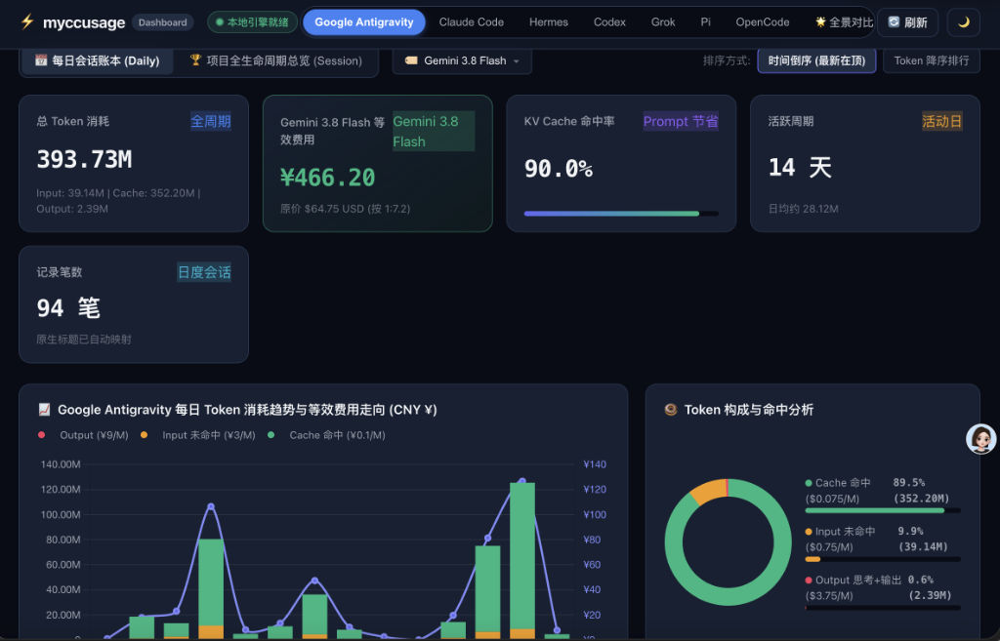
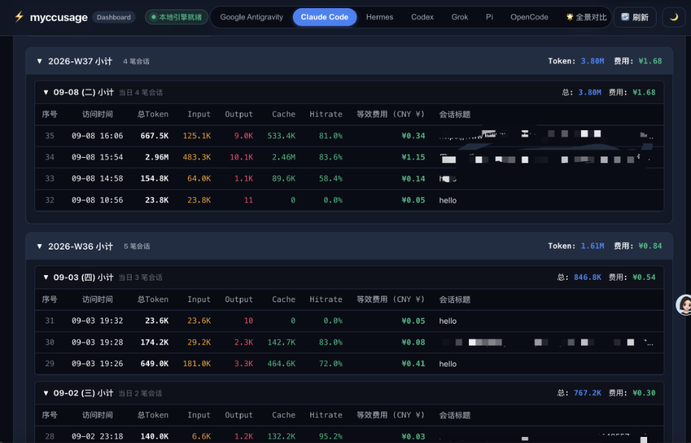

# myccusage

[](https://pypi.org/project/myccusage/)
[](https://www.python.org/)
[](LICENSE)
[](#-安全与性能说明)

> **专为开发者打造的多 AI 编程智能体会话账本与 Token / 费用分析工具。**  
> 天天用 AI 写代码，心里总在打鼓：到底烧了多少 Token？Prompt Cache 命中了吗？换成平替模型能省多少？  
> `myccusage` 聚合分析你的本地编码记录，提供直观的终端表格与高颜值暗黑 Web 看板。  
> **🔒 100% 纯本地离线运行，零联网上传，轻量无后台常驻，极致保护代码与数据隐私。**

---

## 📸 界面预览 (Preview)

### 1. 仪表盘总览与消耗趋势分析
> 实时汇聚全周期 Token 吞吐、KV Cache 命中率、等效成本换算、每日消耗趋势双轴图与命中构成环形图。



### 2. 会话级流水账本与小计折叠
> 自动映射真实会话标题，支持按周、按日自动小计，精确呈现每一笔会话的命中率与费用。



---

## 🛡️ 为什么选择 myccusage？（核心优势与解决痛点）

### 1. 🔒 绝对纯本地与隐私安全（Zero Leak）
- **零联网上传**：所有 Token 统计、费用换算、会话标题提取**全部在你的本地机器单机完成**，绝不向任何云端或第三方服务器上传一行代码、一个 Prompt 或任何敏感配置。
- **纯只读安全解析**：仅以只读方式解析本地各 Agent 的 session 索引文件，不修改、不污染您的任何工程目录和代码库。

### 2. ⚡ 极致轻量，零常驻后台，不占系统性能
- **零大型外部框架负担**：不依赖 Electron、Node.js 服务端或重型数据库，纯 Python 原生标准库 HTTP 服务驱动，极度轻巧省资源。
- **智能 30 秒自退守护**：关闭浏览器页面后，后台服务在 30 秒内检测到无心跳将**自动安静退出**，绝不在系统后台悄悄驻留常驻进程偷跑 CPU 和内存。
- **毫秒级分级切片缓存**：对已结账的历史自然日切片落盘（`~/.cache/myccusage/`），即便是累计达 **数亿 Token（如 393M+）** 的高强度使用记录，也能在 1 秒内瞬间出表。

### 3. 💰 账单明明白白，自由切换平替模型计费
- 支持 **DeepSeek-V4.1-Flash**、**Gemini 3.8 Flash** 等主流模型最新官方计费标准。
- 自动按 `Total = Input + Cache + Output` 守恒定律核算，精确折算人民币（¥）与美元（$），看清换成高性价比平替模型到底能省多少外卖钱。

### 4. 🎯 KV Cache 命中率透明化（省钱硬指标）
- 直观呈现 Prompt 缓存命中比例（例如 50% ~ 90%+），一眼看穿写代码过程中缓存到底省下了多少上下文成本。

### 5. 🗂️ 聚合 7 大主流 AI 编程 Agent
- 一站式打通 **Google Antigravity**、**Claude Code**、**Hermes Agent**、**OpenAI Codex**、**Grok**、**Pi Agent**、**OpenCode**。支持单平台深度透视与多平台跨端「全景对比」。

### 6. 🔍 原生会话标题自动识别
- 告别冷冰冰的 UUID！直击底层存储（Protobuf、SQLite、JSONL）提取人类可读的真实会话标题，轻松回溯历史任务。

---

## 📦 极简两步安装

### 第一步：安装前置依赖开源工具 `ccusage`（全局安装）

`myccusage` 依赖底层开源工具 [ccusage](https://github.com/ryoppippi/ccusage) 采集各智能体的原始切片数据：

```bash
# 使用 npm 全局安装
npm install -g ccusage

# 或使用 bun / pnpm
bun add -g ccusage
# pnpm add -g ccusage
```

### 第二步：安装 `myccusage`

```bash
pip install myccusage
```

> **国内镜像加速安装**（推荐）：
> ```bash
> pip install -i https://pypi.tuna.tsinghua.edu.cn/simple myccusage
> ```

---

## 🚀 快速上手

### 1. 一键启动高颜值本地 Web 看板

在任意终端运行，自动唤起浏览器：

```bash
myccusage ui
# 或
myccusage --web
```
*(默认监听 `http://127.0.0.1:8488`，关闭页面 30 秒后后台服务自动退出，不占系统资源)*

---

### 2. 终端极速查账（CLI 表格）

支持根据当前主力使用的 Agent 传入对应参数：

```bash
# 查看 Google Antigravity 每日会话账本 (默认模式，防跨日漂移)
myccusage --agy

# 查看 Claude Code 每日账本
myccusage --claude

# 查看 Hermes / Codex / OpenCode 等
myccusage --hermes
myccusage --codex
myccusage --opencode

# 查看 Antigravity 项目全生命周期总消耗 (项目维度累计)
myccusage --agy -s

# 找出吃 Token 最多的项目/会话 (按 Token 用量降序排)
myccusage --agy -s -t
```

#### 常用参数速查

| 参数 | 说明 |
| :--- | :--- |
| `--web` / `ui` | 启动本地 Web 可视化仪表盘并自动打开浏览器 |
| `--agy` / `--claude` / `--hermes` / ... | 指定分析的 Agent 类型 |
| `-d` / `--daily` | **每日账本模式**（默认）：按自然日精确切片，带周小计与日小计 |
| `-s` / `--session` | **项目总览模式**：按 Project / 会话全生命周期累计总消耗 |
| `-t` / `--tokens` | 按 Token 消耗降序排列（揪出吞噬 Token 的大任务） |

---

## 🤖 面向开发者与二次开发

如果您是 **AI Coding Assistant** 或准备对本项目进行二次开发（如新增 Agent 适配、扩展计价规则、修改内核调度等），请查阅专属维护文档：

👉 **[README.agent.md](README.agent.md)**

---

## 📄 开源许可证

本项目基于 [MIT License](LICENSE) 开源。欢迎提交 PR 与 Issue！
